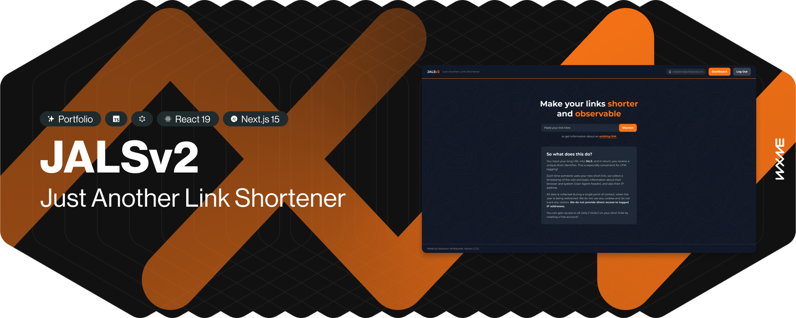

# JALS / Just Another Link Shortener v2

A simple solution for shortening links built with React, Next.js and GraphQL with basic safety features. Initially designed and developed in 2021 as a personal challenge and to get some new experience.

I began work on a refactor in december 2024. Primary goal was to gain practical knowledge of current React (v19) and Next.js (v15) features, including the new App router. As a secondary goal, client application was to fully leverage TailwindCSS and PostCSS features.

> **Now live!** Development stage preview available at [jals2.wirkijowski.dev](https://jals2.wirkijowski.dev/)

## Technology stack

###  Client

- **React 19**
- **Next.js 15** with App router
- **TypeScript**
- **Apollo Client** + `experimental-nextjs-app-support` 
- **PostCSS**
  - Tailwind-CSS
  - Autoprefixer
- `classnames`
- **Eslint**

### API server

- **Apollo Server**
- **GraphQL**
  - `@graphql-tools` — schema loading and merging utilities
  - `graphql-scalars` — additional scalars (e.g. `EmailAddress`)
- **Redis** & **Redis OM** — Redis client and ORM interface
- **Mongoose** — ORM interface for MongoDB
- **Eudoros** - logging utility
- **Luxon** — date utilities
- **Resend** — transactional emails
- **ulid** — internal unique identifiers

### Environment

- Redis-Stack
- MongoDB Community
- Docker with compose

## Functionality

### Operational
- [x] Session management on both client and api
- [x] Auth code transactional emails
- [x] Short link creation
- [x] Redirection logic with safeguards
- [x] Link inspection (`/inspect/[linkId]` & `/[linkId]/+`)
- [x] Reporting functionality — link flagging
- [x] User-agent and address collection (`@todo levarage User-Agent Client Hints API`)
- [x] Light and dark themes

### Planned & In-progress
- [ ] Magic link functionality
- [ ] Transitions, animations
- [ ] Dashboards
- [ ] Link management
- [ ] User management
- [ ] Client to API health checks
- [ ] Full query error handling

---
## Version 1 (2021)

> **See it in action!** Production demo of v1 available at [jals.wirkijowski.dev](https://jals.wirkijowski.dev/)

### Tech stack
- **Client**
  - **React** — frontend framework
  - **React Router** — navigation
  - **SCSS** — CSS preprocessor
  - **CSS Modules** — styling approach
  - **BEM** — class naming methodology
  - **Apollo Client** — communication with API
- **API server**
  - **Apollo Server** — GraphQL server
  - **Mongoose** — ORM interface for MongoDB
  - **Ioredis** — Redis client used for cache
  - **Sentry.io** — monitoring & error tracking
  - **Dotenv** — environment variables loader

### Functionality
- Functional link shortening
- Link inspection using `+` as a modifier at the end of the URL
- Collected data included user's platform, if is mobile device and timestamp of click
- Users were redirected the moment a click is registered (positive response from API)
- If a link is flagged multiple times, users were warned about it and asked to confirm before proceeding with the redirect.

---
No license is available.