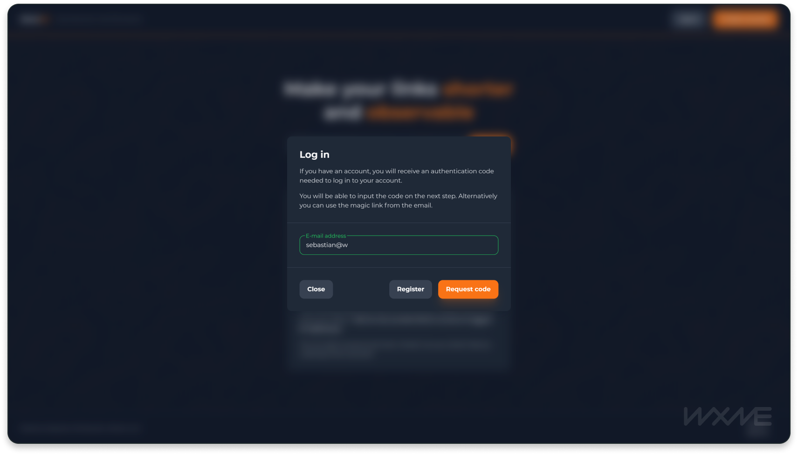
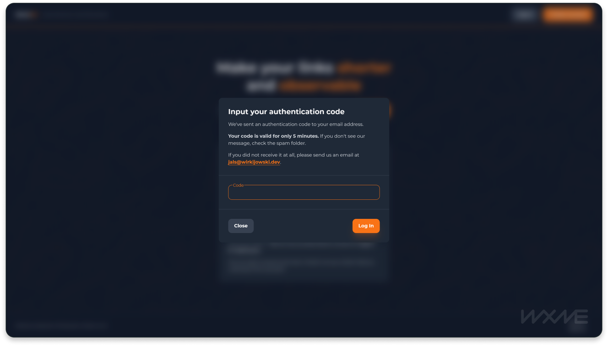

# JALSv2 Client

## Todos

- [x] User dashboard
- [ ] Implement proper error handling on GraphQL queries and mutations
- [ ] Implement transitions between pages
- [ ] Explore better animations

## Summary

### Functionality

- Links
  - Shortening
  - Redirection based on link status and safety
  - Inspection of destination, metadata
- Accounts
  - Password-less 2-step authentication flow
  - Dashboard for analytics and link management
- Light and dark theme

### Implemented Features
#### Dynamic routes (Next.js/App router)
Retrieving link identifiers and redirecting to inspection page on `/[linkId]/+`.

#### Route interception (Next.js/App)
Leveraged for implementing authentication modals and other contextual modals (e.g. link flagging `/inspect/[linkId]/flag`).

#### Server Components (Next.js, React)
Separation of sensitive information, business logic and interactivity layer.

####  Server actions (Next.js) + `useFormState` (React) 
Implemented on all forms that result in mutations. Occasionally leveraging built-in `.bind()` method for additional data.

#### `useContext` (React)
Link context implementation on `/inspect` route, theme context, auth context.

#### Streaming / Suspense (Next,js, React)
Implementation of suspense and fallback skeleton UI elements on dashboard routes.

- [Dashboard (/dashboard)](./src/app/dashboard/(home))
- [ClickList component (/dashboard/[linkId])](./src/components/@dashboard/click-list)
- [LinksTable component (/dashboard)](./src/components/@dashboard/links-table)

## Walkthrough

### Authentication

In JALSv2, users can both register and log in without ever using passwords. My approach focuses on one-time codes generated on the server and provided to users by a transactional email via Resend.

[...in progress]